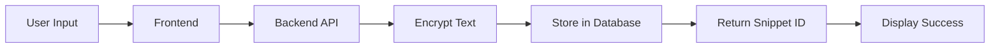
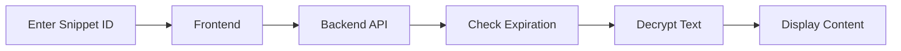
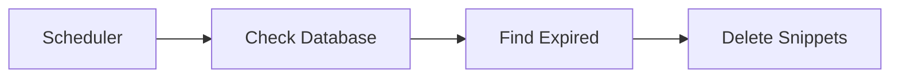

# 🔒 Secure Pastebin Application

A privacy-focused pastebin application that allows users to share encrypted text snippets with automatic expiration. Built with Flask, SQLAlchemy, and modern encryption standards.

## 📋 Table of Contents
- [Features](#-features)
- [Technical Stack](#-technical-stack)
- [Application Workflow](#-application-workflow)
- [Security Features](#-security-features)
- [Installation](#-installation)
- [Usage Guide](#-usage-guide)
- [API Documentation](#-api-documentation)

## ✨ Features
- End-to-end encryption of text snippets
- Configurable expiration times (from seconds to weeks)
- Automatic deletion of expired snippets
- EST timezone display
- Modern, responsive UI
- No user tracking or data retention
- Preset duration options for convenience

## 🛠 Technical Stack
- **Backend**: Python Flask
- **Database**: SQLite with SQLAlchemy ORM
- **Encryption**: Fernet (symmetric encryption)
- **Frontend**: HTML, JavaScript, TailwindCSS
- **Time Management**: APScheduler, Pytz
- **Security**: Python Cryptography library

## 🔄 Application Workflow

### 1. Creating a Snippet


**Process:**
1. User enters text and selects expiration time
2. Frontend validates input
3. Backend receives request with:
   - Text content
   - Expiration time in seconds
4. Backend:
   - Generates unique snippet ID
   - Encrypts the text
   - Calculates expiration timestamp
   - Stores in database
5. Returns snippet ID to user

### 2. Retrieving a Snippet


**Process:**
1. User enters snippet ID
2. Backend:
   - Verifies snippet exists
   - Checks if expired
   - Decrypts content if valid
3. Frontend displays:
   - Decrypted text
   - Expiration time in EST

### 3. Automatic Cleanup


**Process:**
- Background job runs every 5 minutes
- Identifies expired snippets
- Permanently deletes them from database

## 🔐 Security Features

### Encryption
- Uses Fernet symmetric encryption
- Unique encryption key per installation
- Key stored securely on server
- All snippets encrypted at rest

### Data Privacy
- No user tracking
- No logs of snippet content
- Automatic deletion after expiration
- No personal data collection

### Time Management
- All times stored in UTC
- Converted to EST for display
- Precise expiration enforcement
- Background cleanup process

## 📥 Installation

1. Clone the repository:
```bash
git clone <repository-url>
cd secure-pastebin
```

2. Create virtual environment:
```bash
python -m venv venv
source venv/bin/activate  # On Windows: venv\Scripts\activate
```

3. Install dependencies:
```bash
pip install -r requirements.txt
```

4. Run the application:
```bash
python app.py
```

## 📖 Usage Guide

### Creating a Snippet
1. Enter your text in the input area
2. Choose expiration time:
   - Use preset buttons (5min, 1hr, 1day, 1week)
   - Or enter custom time in seconds
3. Click "Create Snippet"
4. Copy the generated snippet ID

### Retrieving a Snippet
1. Enter the snippet ID
2. Click "Retrieve Snippet"
3. View the decrypted content and expiration time

## 🔌 API Documentation

### POST /api/snippets
Creates a new encrypted snippet

**Request Body:**
```json
{
    "text": "Your text content",
    "expiration_seconds": 3600
}
```

**Response:**
```json
{
    "id": "generated-snippet-id",
    "expiration_time": "2024-03-20T12:00:00-04:00",
    "timezone": "EST"
}
```

### GET /api/snippets/{snippet_id}
Retrieves a snippet by ID

**Response:**
```json
{
    "text": "Decrypted text content",
    "expiration_time": "2024-03-20T12:00:00-04:00",
    "timezone": "EST"
}
```

## ⚠️ Error Handling
- Invalid snippet ID: 404 Not Found
- Expired snippet: 404 Not Found
- Invalid input: 400 Bad Request
- Server errors: 500 Internal Server Error

## 🔒 Privacy Considerations
- All snippets are automatically deleted after expiration
- No backup or recovery of expired snippets
- No tracking or analytics
- Local storage only 